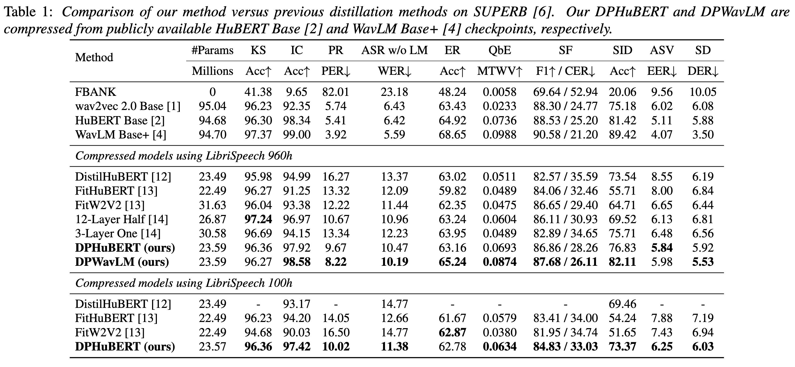
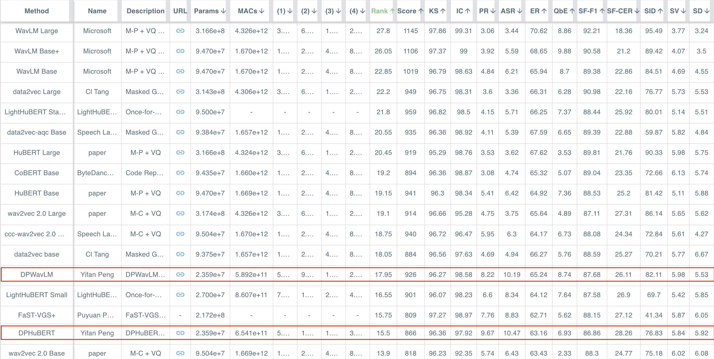
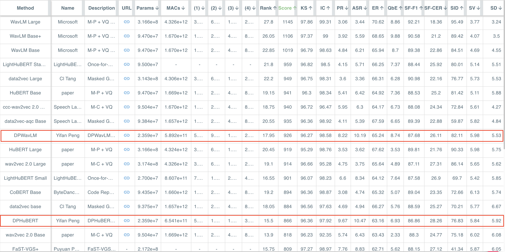

# DPHuBERT


This repo contains the code and models for our paper: 

Yifan Peng, Yui Sudo, Shakeel Muhammad, and Shinji Watanabe, “DPHuBERT: Joint Distillation and Pruning of Self-Supervised Speech Models,” in Proc. INTERSPEECH, 2023.
[[arXiv](https://arxiv.org/abs/2305.17651)] [[paper](https://www.isca-speech.org/archive/interspeech_2023/peng23c_interspeech.html)]


## Overview

DPHuBERT is a task-agnostic compression method based on **joint distillation and structured pruning**. DPHuBERT outperforms pure distillation methods in most [SUPERB](https://superbbenchmark.org/leaderboard) tasks. It also performs well with limited training data. Our method can be directly applied to various speech SSL models like HuBERT (eithr Base or Large) and WavLM.

The training procedure is illustrated in the figure below:


---

The main results are summarized in this table:



---

Our models are also shown in the [SUPERB leaderboard](https://superbbenchmark.org/leaderboard). Here are the results sorted by Rank and Score, respectively.



---



## Requirements

Our code is based on PyTorch, TorchAudio, and PyTorch Lightning. Please install these required packages from their official sources. We include our versions below for reference, but other versions might also work.

```
# Main packages for training
pytorch=1.13.1
cuda=11.6.2
pytorch-lightning=1.8.1
torchaudio=0.13.1

# Other packages for obtaining pre-trained SSL
fairseq=0.12.2
transformers=4.24.0
```


## Usage

Please follow these steps to train DPHuBERT.

### 1. Download and prepare audio data

The following script creates file lists for LibriSpeech in tsv format. `LibriSpeech_PATH` is the path to the downloaded raw data.

```bash
python prepare_data.py --data LibriSpeech_PATH --out data/librispeech
```

The output directory has this structure:

```
data
└── librispeech
    ├── train100.tsv
    ├── train960.tsv
    └── valid.tsv
```

### 2. Download pre-trained SSL (e.g., HuBERT Base) and convert it to our format

We need to download pre-trained SSL checkpoints from fairseq or Hugging Face and then convert them to our own format. These models will be used as the teacher for compression. For example, we can obtain HuBERT Base by executing:

```bash
mkdir -p pretrained
python convert_hubert_from_hf.py
```

The converted checkpoint will be saved as `pretrained/hubert-base-ls960.hf.pth`. The output path can be changed in the python script.

### 3. Start training

After preparing data and pre-trained model, we can start training by sequentially executing the four python scripts: `distill.py`, `prune.py`, `final_distill.py`, and `save_final_ckpt.py`. We provide a shell script `run.sh` to better record the hyper-parameters. By default, we request 4 NVIDIA A100 (40GB) GPUs via the SLURM job scheduler. It takes around 6 hours to compress HuBERT Base. Please modify the hyper-parameters if the environment is different. For example, one can reduce the number of GPUs but enable gradient accumulation to keep the total batch size in a similar range.

```bash
sbatch run.sh
```

After training, the compressed model parameters and configurations will be saved in the corresponding experiment directory. We can easily load a compressed model as follows:

```python
import torch
from wav2vec2.model import wav2vec2_model

ckpt_path = "path/to/ckpt"
ckpt = torch.load(ckpt_path)
model = wav2vec2_model(**ckpt["config"])
result = model.load_state_dict(ckpt["state_dict"], strict=False)
print(f"missing: {result.missing_keys}, unexpected: {result.unexpected_keys}")
print(f"{sum(p.numel() for p in model.parameters())} params")
```


## Pre-trained models

We also provide some pre-trained models.

| Name | Teacher | Sparsity | Params | Link |
|:---:|:---:|:---:|:---:|:---:|
| DPHuBERT | HuBERT Base | 0.75 | 23,585,946 | [Hugging Face](https://huggingface.co/pyf98/DPHuBERT/blob/main/DPHuBERT-sp0.75.pth) |
| DPWavLM | WavLM Base+ | 0.75 | 23,586,325 | [Hugging Face](https://huggingface.co/pyf98/DPHuBERT/blob/main/DPWavLM-sp0.75.pth) |


## Citation

Please cite related papers if you use DPHuBERT.

```
@inproceedings{peng23c_interspeech,
  author={Yifan Peng and Yui Sudo and Shakeel Muhammad and Shinji Watanabe},
  title={{DPHuBERT: Joint Distillation and Pruning of Self-Supervised Speech Models}},
  year=2023,
  booktitle={Proc. INTERSPEECH 2023},
  pages={62--66},
  doi={10.21437/Interspeech.2023-1213}
}
@INPROCEEDINGS{10095780,
  author={Peng, Yifan and Kim, Kwangyoun and Wu, Felix and Sridhar, Prashant and Watanabe, Shinji},
  booktitle={ICASSP 2023 - 2023 IEEE International Conference on Acoustics, Speech and Signal Processing (ICASSP)}, 
  title={Structured Pruning of Self-Supervised Pre-Trained Models for Speech Recognition and Understanding}, 
  year={2023},
  pages={1-5},
  doi={10.1109/ICASSP49357.2023.10095780}}
```

## Acknowledgments

We thank the authors of the following projects for open-sourcing their code:
- [TorchAudio](https://github.com/pytorch/audio): Our speech SSL models and training pipelines are based on TorchAudio.
- [FLOP](https://github.com/asappresearch/flop): Our implementation of the Hard Concrete Distribution is from FLOP.
- [CoFiPruning](https://github.com/princeton-nlp/CoFiPruning): Some of our training hyper-parameters follow CoFiPruning.

Our method is inspired by prior studies:
- Distillation: [DistilHuBERT](https://arxiv.org/abs/2110.01900), [FitHuBERT](https://arxiv.org/abs/2207.00555), [Deep versus Wide](https://arxiv.org/abs/2207.06867)
- Pruning: [FLOP](https://arxiv.org/abs/1910.04732), [CoFiPruning](https://arxiv.org/abs/2204.00408), [HJ-Pruning](https://arxiv.org/abs/2302.14132)
